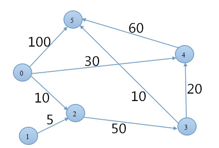

# Dijkstra算法

## 算法概述

**Dijkstra(迪杰斯特拉)**算法是典型的**单源最短路径算法**。主要特点是**以起始点为中心向外层层扩展,直到扩展到终点为止**。Dijkstra算法是很有代表性的最短路径算法,在很多专业课程中都作为基本内容有详细的介绍，如数据结构，图论，运筹学等等。注意该算法要求图中不存在负权边。

问题描述：在无向图 G=(V,E) 中，假设每条边 E[i] 的长度为 w[i]，找到由顶点V0 到其余各点的最短路径。(单源最短路径)

## 基本概念

无向图G=<V,E>,其中:

* V是非空集合,称为**顶点集合**;
* E是V中元素构成的无序二元组的集合,称为**边集**。

直观来讲，若一个图中每条边都是无方向的，则称为无向图.

1. 无向边的表示
  无向图中的边均是顶点的无序对，无序对通常用圆括号表示。无需对(Vi,Vj)和(Vj,Vi)表示同一条边。

2. 无向图的表示
  顶点集:V(G)={V1, V2, V3, V4, V5, V6}
  边集:E(G)={(V1,V2), (V1,V3), (V1,V6), (V2,V4), (V2,V3), (V3,V4), (V3,V6), (V4,V5), (V5,V6)}
  
  

## 算法描述

1)算法思想：设G=(V,E)是一个带权有向图，把图中顶点集合V分成两组，第一组为已求出最短路径的顶点集合(用S表示，初始时S中只有一个源点，以后每求得一条最短路径 , 就将加入到集合S中，直到全部顶点都加入到S中，算法就结束了)，第二组为其余未确定最短路径的顶点集合(用U表示)，按最短路径长度的递增次序依次把第二组的顶点加入S中。在加入的过程中，总保持从源点v到S中各顶点的最短路径长度不大于从源点v到U中任何顶点的最短路径长度。此外，每个顶点对应一个距离，S中的顶点的距离就是从v到此顶点的最短路径长度，U中的顶点的距离，是从v到此顶点只包括S中的顶点为中间顶点的当前最短路径长度。

2)算法步骤：

a. 初始时，S只包含源点，即S＝{v}，v的距离为0。U包含除v外的其他顶点，即:U={其余顶点}，若v与U中顶点u有边，则<u,v>正常有权值，若u不是v的出边邻接点，则<u,v>权值为∞。

b. 从U中选取一个距离v最小的顶点k，把k，加入S中(该选定的距离就是v到k的最短路径长度)。

c. 以k为新考虑的中间点，修改U中各顶点的距离；若从源点v到顶点u的距离(经过顶点k)比原来距离(不经过顶点k)短，则修改顶点u的距离值，修改后的距离值的顶点k的距离加上边上的权。

d. 复步骤b和c直到所有顶点都包含在S中。

## 算法代码实现:

代码实现以下图为例


``` java
//根据有向图构造邻接矩阵表,a[i][j]表示Vi与Vj的连通距离
private static int max = Integer.MAX_VALUE;
private static int dist[] = new int[6];
private static int prev[] = new int[6];
private static int a[][] = {
	{0, max, 10, max, 30, 100},
	{max, 0, 5, max, max, max},
	{max, max, 0, 50, max, max},
	{max, max, max, 0, 20, 10},
	{max, max, max, max, 0, 60},
	{max, max, max, max, max, 0}
};

/*
 * dijkstra算法 source表示源点位置
 */
public void dijkstra(int source, int[][] a, int dist[], int prve[]) {
	int len = dist.length;
	// s[]:存储已经找到最短路径的顶点，false为未求得
	boolean[] isVisited = new boolean[len + 1];

	for (int i = 0; i < len; i++) {
		dist[i] = a[source][i];
		isVisited[i] = false;
		/*
		 * prve[]数组存储源点到顶点vi之间的最短路径上该顶点的前驱顶点, 若从源点到顶点vi之间无法到达，则前驱顶点为-1
		 */
		if (dist[i] < Integer.MAX_VALUE)
			prve[i] = source;
		else
			prve[i] = -1;
	}

	dist[source] = 0; // 初始化v0源点属于s集
	isVisited[source] = true; // 表示v0源点已经求得最短路径

	for (int i = 0; i < len; i++) {
		int min = Integer.MAX_VALUE; // temp暂存v0源点到vi顶点的最短路径
		int u = source;
		for (int j = 0; j < len; j++) {
			if ((!isVisited[j]) && dist[j] < min) { // 顶点vi不属于s集当前顶点不属于s集(未求得最短路径)并且距离v0更近
				u = j; // 更新当前源点,当前vi作为下一个路径的源点
				min = dist[j]; // 更新当前最短路径
			}
		}
		isVisited[u] = true; // 顶点vi进s集
		// 更新当前最短路径以及路径长度
		for (int j = 0; j < len; j++) {
			if ((!isVisited[j]) && a[u][j] < Integer.MAX_VALUE) { // 当前顶点不属于s集(未求得最短路径)并且当前顶点有前驱顶点
				int newDist = dist[u] + a[u][j]; // 累加更新最短路径
				if (newDist < dist[j]) {
					dist[j] = newDist; // 更新后的最短路径
					prve[j] = u; // 当前顶点加入前驱顶点集
				}
			}
		}
	}
}
```

[完整测试用例](../../code/dynamic_programming/Dijkstra.java)


参考:

[最短路径―Dijkstra算法和Floyd算法](http://www.cnblogs.com/biyeymyhjob/archive/2012/07/31/2615833.html)

